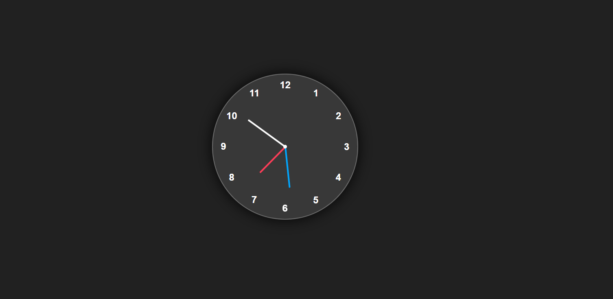

# 🕒 Analog Clock

A simple and elegant **Analog Clock** built using **HTML**, **CSS**, and **JavaScript**.  
It displays the current time dynamically and updates every second just like a real clock.

---

## 🚀 Live Demo
🔗 [Click Here to View Live Preview](https://dineshsinghdhami.com.np/analog-clock)

---

## 📸 Screenshot

---

## 💡 Features
- Real-time updating clock hands 🕐 
- Smooth animations using CSS transitions  
- Fully responsive and clean UI  
- Simple and beginner-friendly JavaScript logic  

---

## 🧩 Technologies Used
- **HTML** 
- **CSS** 
- **JavaScript**

---

## ⚙️ How It Works
1. The clock is built using HTML elements for hour, minute, and second hands.  
2. CSS handles the circular design and positioning of hands.  
3. JavaScript calculates the rotation angle for each hand based on the current time.  
4. The hands are rotated every second using the `setInterval()` function.

---

## 📂 Project Structure

📁 analog-clock

┣ 📄 index.html

┣ 🎨 style.css

┣ ⚙️ script.js

┗ 🖼️ analog-clock.png

---

## 👨‍💻 Author
**Dinesh Singh Dhami**  
🌐 [Portfolio Website](https://dineshsinghdhami.com.np)  
💼 [LinkedIn](https://www.linkedin.com/in/thecodingdhami)  
🐙 [GitHub](https://github.com/thecodingdhami)  
🐦 [Twitter (X)](https://x.com/thecodingdhami)  
▶️ [YouTube](https://youtube.com/@thecodingdhami1)
